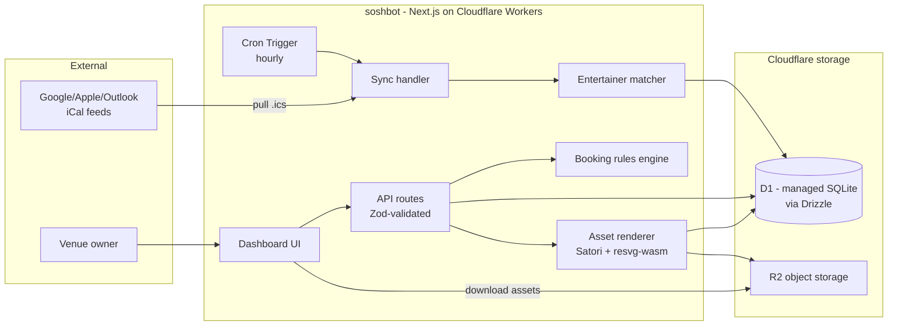
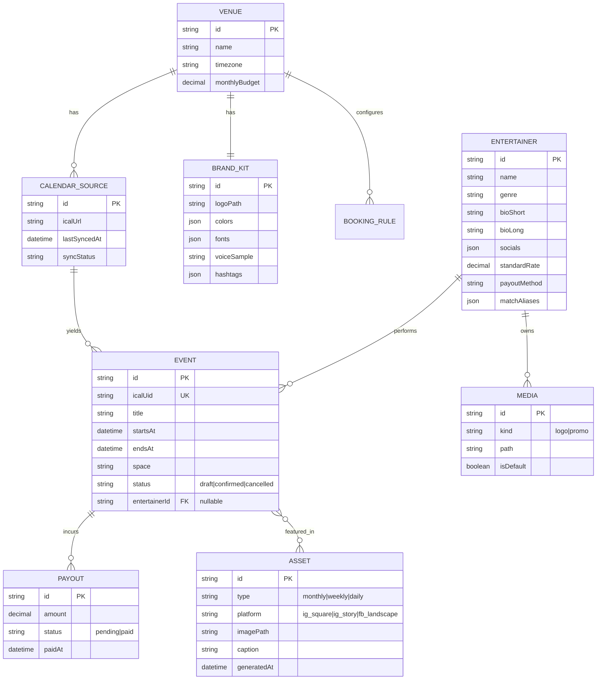

# soshbot — Architecture

## Stack

Everything runs on Cloudflare's developer platform — one vendor, one dashboard, one bill (~$5/mo Workers Paid; D1 and R2 within free tiers).

| Layer | Choice | Why |
|---|---|---|
| Framework | Next.js 15 (App Router) + TypeScript, deployed to **Cloudflare Workers** via OpenNext adapter (1.0 GA) | UI + API in one repo; top job-market stack; sub-3ms cold starts |
| ORM / DB | Drizzle ORM + **Cloudflare D1** (managed SQLite) | No database server; D1 free tier → $0; Drizzle has first-class D1 support and is itself a hot resume keyword. Local dev uses wrangler's local D1 (real SQLite file) |
| iCal parsing | `node-ical` (Workers `nodejs_compat`) | Mature RRULE/timezone handling |
| Image rendering | Satori + `@resvg/resvg-wasm` (JSX → SVG → PNG) | Brand-templated graphics as React components; WASM resvg runs on Workers |
| Background jobs | **Cron Triggers** | Native scheduled invocations for hourly sync + asset pre-render; no in-process scheduler to keep alive |
| Auth | Auth.js, credentials + optional OAuth | Single-owner app; session-based |
| Validation | Zod at every API boundary | Runtime safety, shared types |

## System overview



## Data model



Notes:
- `EVENT.icalUid` is the sync anchor: re-syncs upsert on it, so local enrichments (entertainer link, payouts) survive.
- `ENTERTAINER.matchAliases` feeds the fuzzy matcher ("The Hi-Tones", "Hi Tones duo" → same act).
- `VENUE` is a table from day one so multi-tenant later is a migration, not a rewrite.

## Key flows

### iCal sync
1. Cron fires (or manual trigger) → fetch each `CALENDAR_SOURCE` URL with ETag/If-Modified-Since.
2. Parse with `node-ical`, expand recurrences within a rolling 6-month window.
3. Upsert events on `icalUid`; deletions in feed → mark `cancelled`, never hard-delete.
4. Unmatched titles run through matcher (normalized Levenshtein against names + aliases); confidence ≥ threshold auto-links, else lands in review queue.
5. Sync result recorded on `CALENDAR_SOURCE` for the dashboard health widget.

### Asset generation
1. Owner picks asset type + date range (or accepts the scheduled pre-render).
2. Server assembles props: events, entertainer media, brand kit.
3. React template per asset type renders via Satori → SVG → PNG at each platform size.
4. Caption generated from a template grammar (event facts + venue voice + entertainer handles).
5. Stored in blob storage, listed in review gallery for download/copy.

### Booking rules engine
Pure function: `(events, rules, budget) → Alert[]`. Runs on every sync and edit. Alert types: `CONFLICT`, `GAP`, `VARIETY`, `BUDGET`. Deterministic and side-effect-free → trivially unit-testable, which is the point for the portfolio.

### Data durability (zero-ops database)
- D1 is Cloudflare-managed SQLite: replication, backups, and concurrency are the platform's problem, not ours.
- D1 Time Travel provides point-in-time restore for the last 30 days — no backup pipeline to build.
- Local dev: wrangler runs D1 as a plain local SQLite file; Drizzle migrations apply identically in both environments.
- CSV is the export format, not the store: payout reports, event lists, and entertainer rosters export as CSV for the owner's spreadsheet workflow.

## Project layout

```
soshbot/
├── app/                # Next.js App Router (pages + api routes)
├── components/         # UI + asset templates (templates render both on-screen preview and Satori export)
├── lib/
│   ├── sync/           # ical fetch, parse, upsert
│   ├── match/          # entertainer fuzzy matcher
│   ├── rules/          # booking rules engine (pure)
│   └── render/         # satori pipeline, caption grammar
├── db/                 # Drizzle schema + migrations + seed (demo data)
├── infra/              # Terraform: R2, D1, DNS (see DEVSECOPS.md)
├── wrangler.toml       # Workers config: bindings (D1, R2), cron triggers
└── .github/workflows/  # CI/CD
```

## Security posture (summary)

Auth on every route via middleware; Zod validation at all boundaries; iCal fetcher pinned to https with SSRF guard (block private IP ranges, no redirects to non-http(s)); uploaded media type-sniffed and size-capped; secrets only via environment. Full pipeline controls in DEVSECOPS.md.
